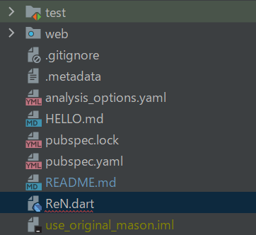

# use ren_mason

[](https://github.com/felangel/mason)

[mason](https://pub.dev/packages/mason)

### ren_mason という名前で公開している global masonをこちらから呼び出してみる
```shell
$ mason make ren_mason 

? rens (ReN) ReN
✓ Generated 2 files. (0.1s)
  created HELLO.md
  created ReN.dart

```

### 上記は ren_masonを作成時の brick.yamlで指定したものである
```shell
vars:
  name:
    type: string
    description: mason を導入します！
    default: ReN
    prompt: rens
```

### 結果としてルートディレクトリに dartファイルが作成される
